# 🎬 Netflix Data Analysis

A detailed data analysis project that explores trends, content types, genres, ratings, and top contributors on Netflix using Python, Pandas, Matplotlib, and Seaborn.

✨ Features

    📊 13+ Clean and Insightful Visual Charts
    🧹 Data Cleaning and Preprocessing with Pandas
    🔍 Exploratory Data Analysis on Netflix Titles
    📁 Auto-saves all plots to the 'plots/' folder
    🎯 Focused on Movies, TV Shows, Genres, Ratings, Countries, and People

📚 Dataset

    Source: Netflix Titles Dataset from Kaggle
    Data Fields:
        Title, Type, Director, Cast, Country,
        Date Added, Release Year, Rating, Duration, Genre
    Key Insights:
        The dataset helps uncover global trends in Netflix content,
        including what gets produced, when, and by whom.

🖼️ Chart Previews

### Movies vs TV Shows  
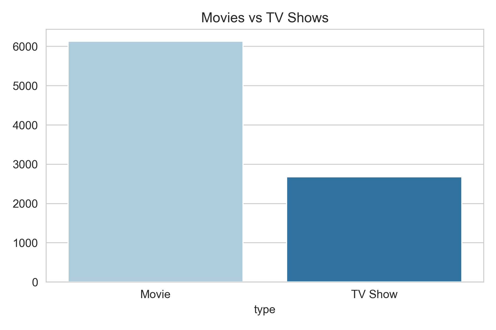

### Top Producing Countries  
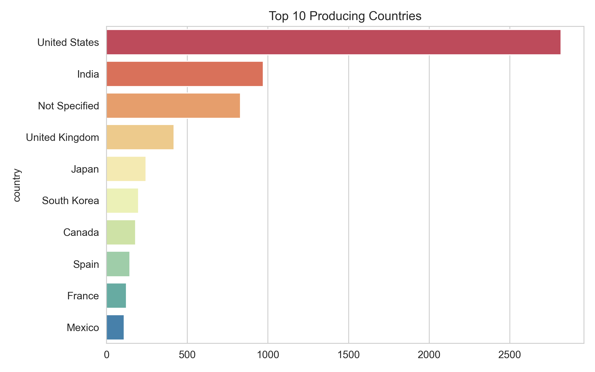

### Yearly Additions  
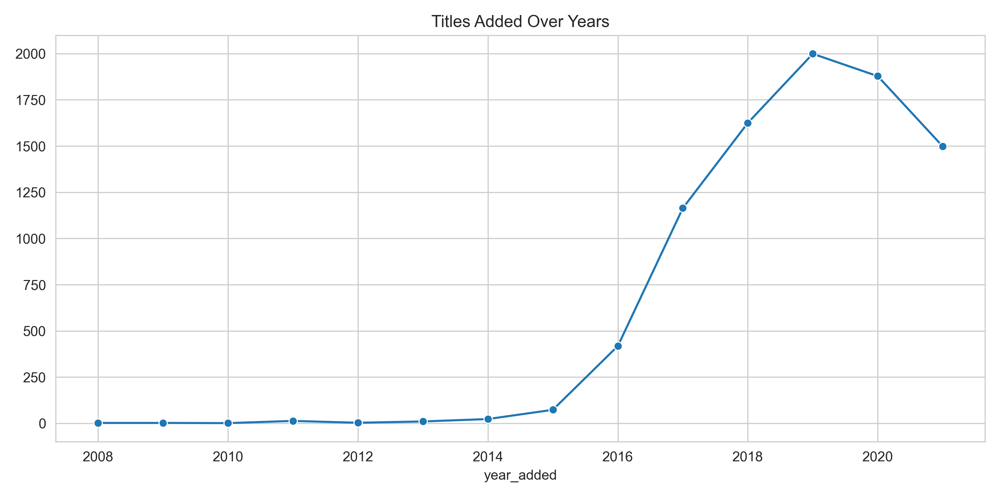

### Top 10 Genres  
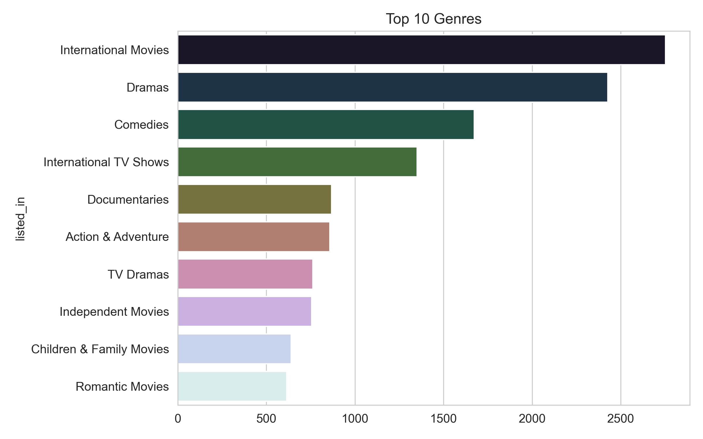

### Content by Rating  
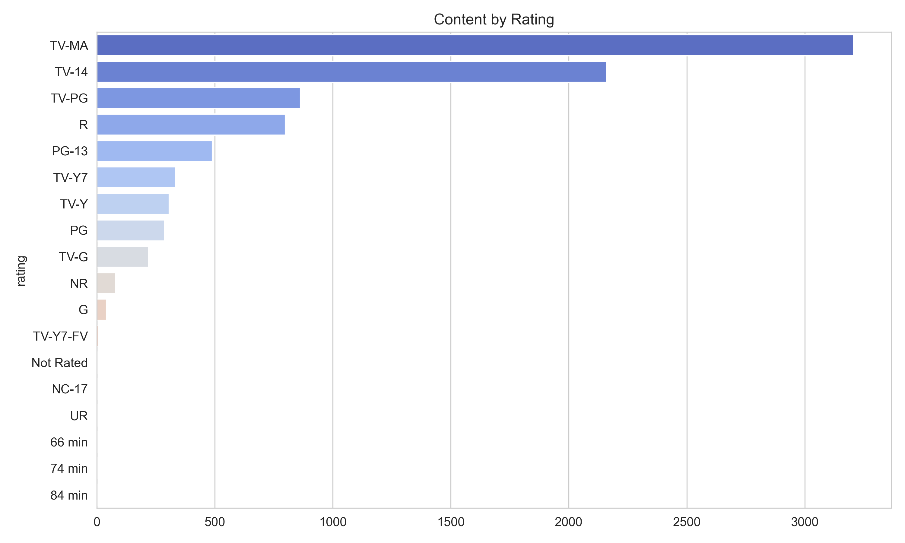

### Release Years Over Time  
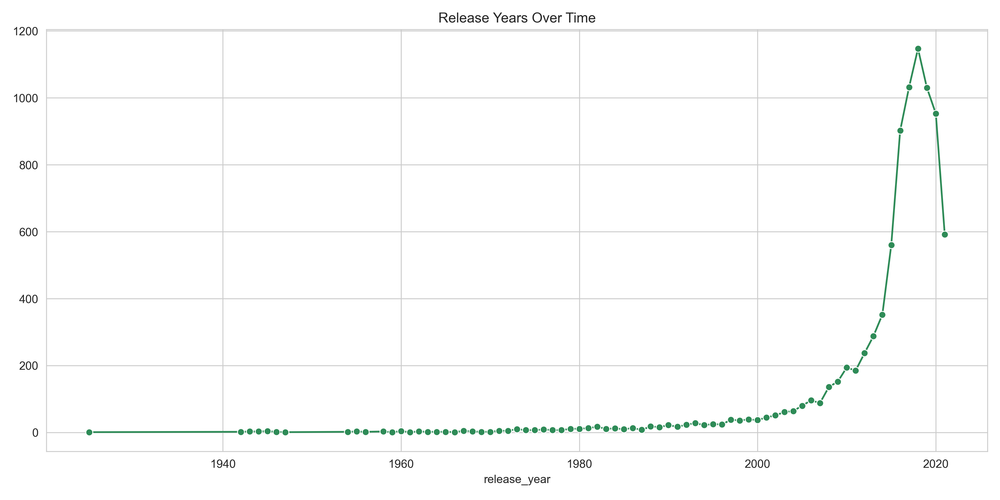

### Top 10 Directors  
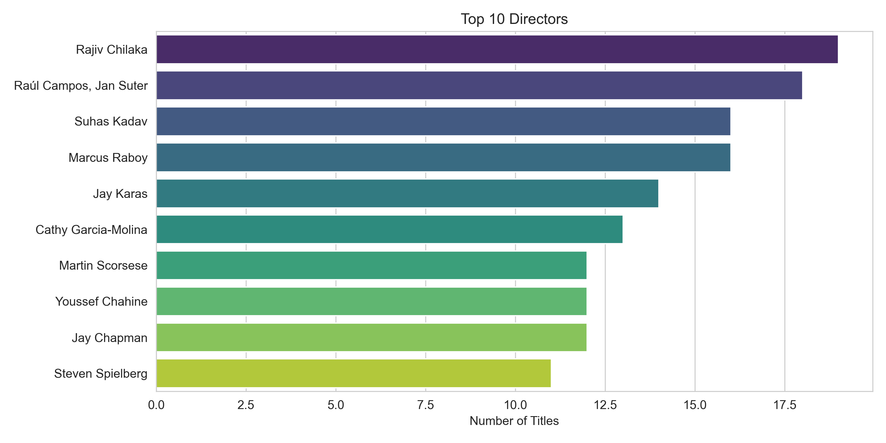

### Top 10 Actors  
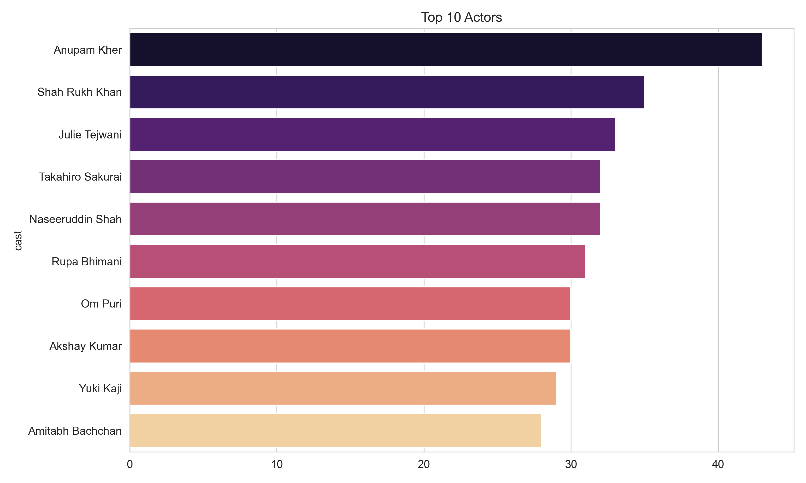

### Ratings by Content Type  
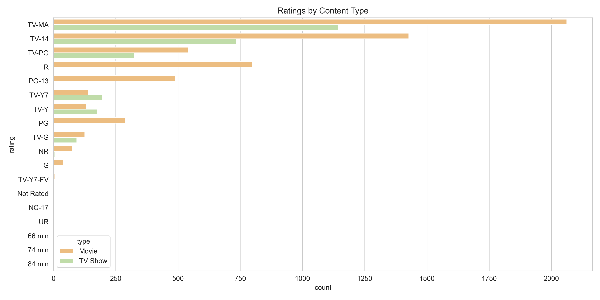

### Release vs Added Year  
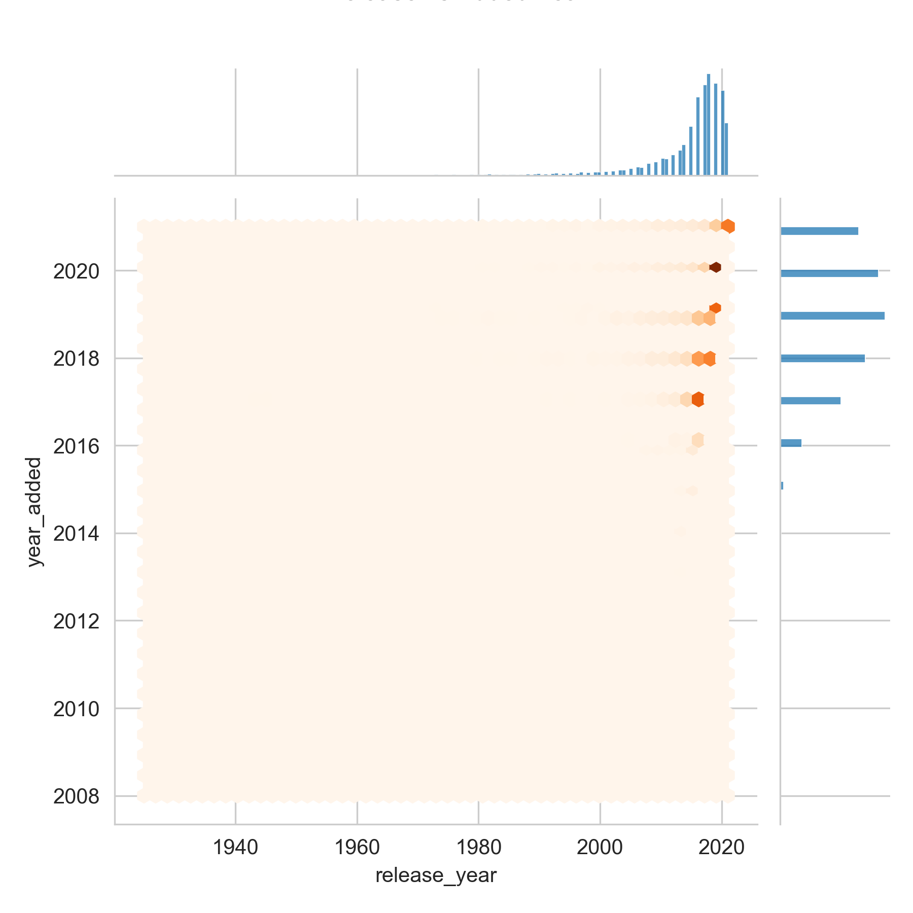

### Monthly Content Additions  
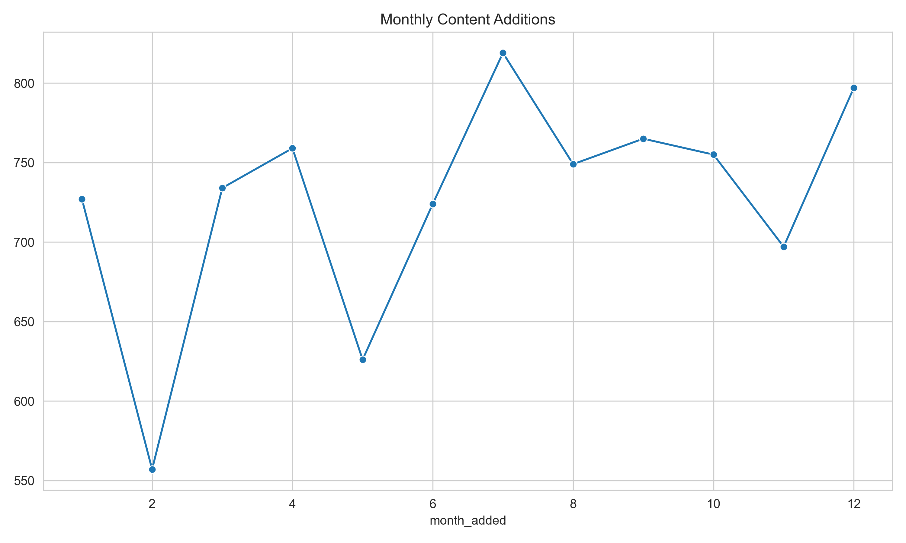

🛠️ How to Run Locally

Clone this repo

```bash
git clone https://github.com/charankumar-g/netflix-data-analysis.git
cd netflix-data-analysis
````

Install dependencies

```bash
pip install pandas matplotlib seaborn
```

Run the script

```bash
python main.py
```

📂 Project Structure

├── main.py                   # Data analysis and plotting script
├── netflix\_titles.csv       # Original dataset
├── plots/                   # Folder with saved plots
└── README.md

🚀 Tech Stack

```
Python
Pandas, NumPy
Matplotlib, Seaborn
Data Cleaning + EDA
```

🔗 Connect with Me

```
🌚 Author: Charan Kumar G  
📩 Email: charankumar.career@gmail.com  
🔗 LinkedIn: linkedin.com/in/charankumar-g
```

```

-
```
